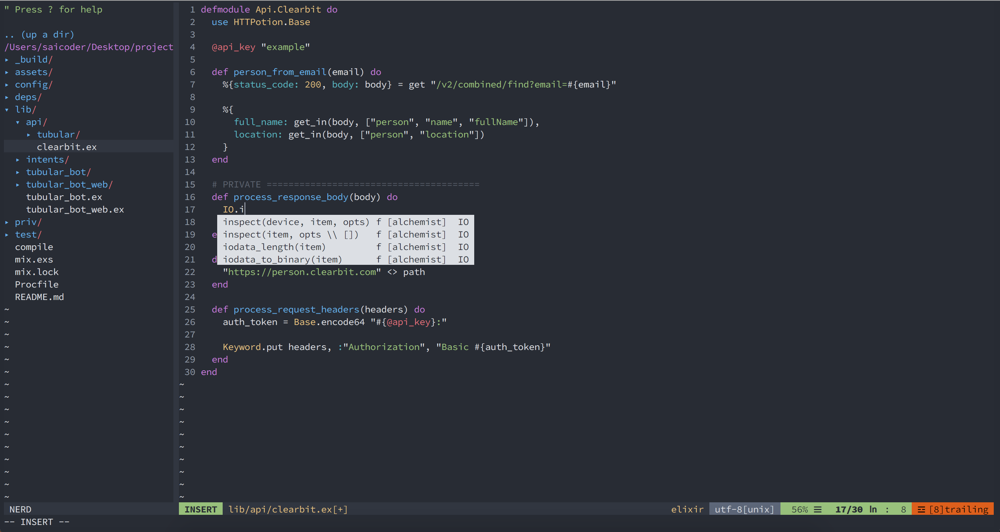

.files
=================

Neo Vim and Zsh configuration files

Installation
----------------

Neo Vim:

`git clone https://github.com/saicoder/dotfiles.git ~/.config/nvim`

Then run :PlugClean and :PlugInstall to install plugins

Zsh(in .zshrc): `source path-to/zsh-config.sh` 

###Theme
Theme is [One Half Dark](https://github.com/sonph/onehalf). Font is *Source Code Pro*
